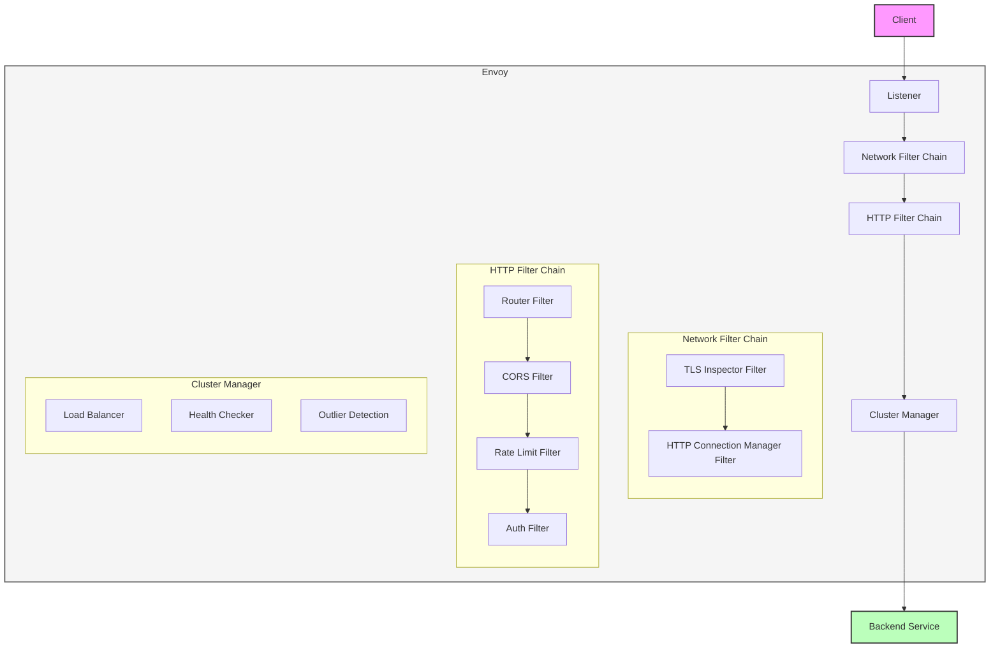

```mermaid

flowchart TD
    Client[Client] --> Listener[Listener]
    
    subgraph Envoy
        Listener --> Network[Network Filter Chain]
        
        subgraph "Network Filter Chain"
            direction TB
            nf1[TLS Inspector Filter]
            nf2[HTTP Connection Manager Filter]
            nf1 --> nf2
        end
        
        Network --> HTTP[HTTP Filter Chain]
        
        subgraph "HTTP Filter Chain"
            direction TB
            hf1[Router Filter]
            hf2[CORS Filter]
            hf3[Rate Limit Filter]
            hf4[Auth Filter]
            hf1 --> hf2 --> hf3 --> hf4
        end
        
        HTTP --> Cluster[Cluster Manager]
        
        subgraph "Cluster Manager"
            direction TB
            LoadBalancer[Load Balancer]
            HealthChecker[Health Checker]
            OutlierDetection[Outlier Detection]
        end
    end
    
    Cluster --> Backend[Backend Service]

    style Client fill:#f9f,stroke:#333,stroke-width:2px
    style Envoy fill:#f5f5f5,stroke:#666,stroke-width:2px
    style Backend fill:#bfb,stroke:#333,stroke-width:2px


```