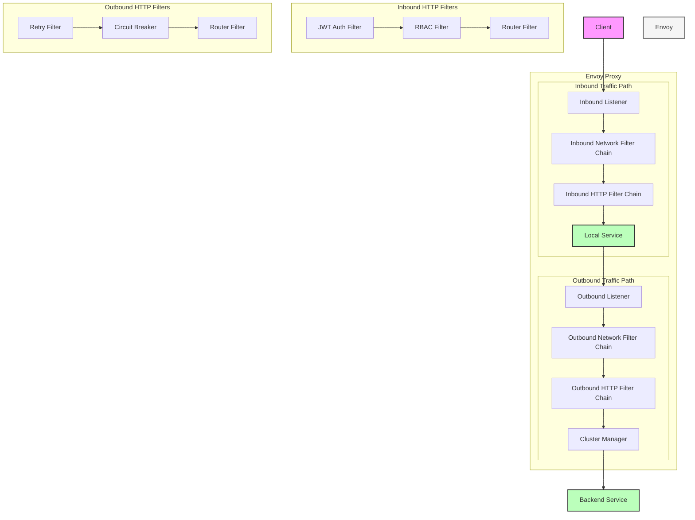

```mermaid

flowchart TD
    Client[Client] --> InListener[Inbound Listener]
    
    subgraph "Envoy Proxy"
        subgraph "Inbound Traffic Path"
            InListener --> InNetwork[Inbound Network Filter Chain]
            InNetwork --> InHTTP[Inbound HTTP Filter Chain]
            InHTTP --> LocalService[Local Service]
        end
        
        subgraph "Outbound Traffic Path"
            LocalService --> OutListener[Outbound Listener]
            OutListener --> OutNetwork[Outbound Network Filter Chain]
            OutNetwork --> OutHTTP[Outbound HTTP Filter Chain]
            OutHTTP --> ClusterMgr[Cluster Manager]
        end
    end
    
    ClusterMgr --> Backend[Backend Service]

    %% 入站过滤器链细节
    subgraph "Inbound HTTP Filters"
        direction LR
        IF1[JWT Auth Filter]
        IF2[RBAC Filter]
        IF3[Router Filter]
        IF1 --> IF2 --> IF3
    end

    %% 出站过滤器链细节
    subgraph "Outbound HTTP Filters"
        direction LR
        OF1[Retry Filter]
        OF2[Circuit Breaker]
        OF3[Router Filter]
        OF1 --> OF2 --> OF3
    end

    style Client fill:#f9f,stroke:#333,stroke-width:2px
    style Envoy fill:#f5f5f5,stroke:#666,stroke-width:2px
    style LocalService fill:#bfb,stroke:#333,stroke-width:2px
    style Backend fill:#bfb,stroke:#333,stroke-width:2px


```