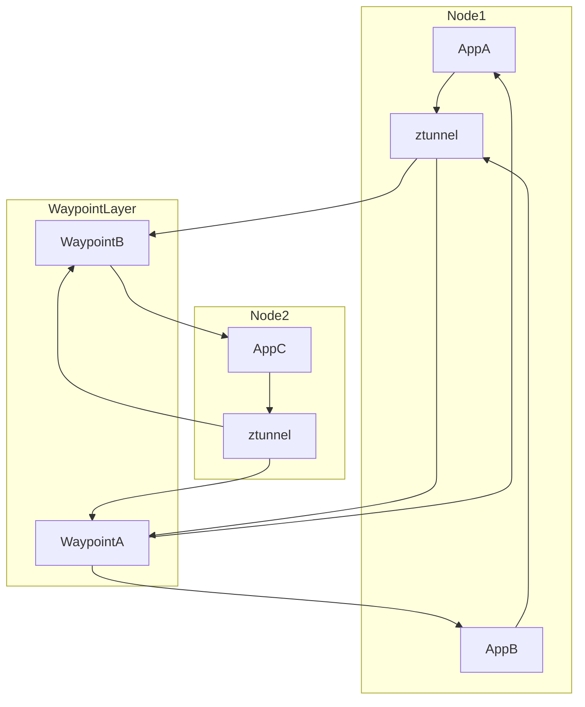

```mermaid

graph TD
    subgraph N1[Node1]
        A[AppA]
        B[AppB]
        Z1[ztunnel]
    end
    subgraph N2[Node2]
        C[AppC]
        Z2[ztunnel]
    end
    subgraph WP[WaypointLayer]
        W1[WaypointA]
        W2[WaypointB]
    end
    A-->Z1
    B-->Z1
    C-->Z2
    Z1-->W1
    Z1-->W2
    Z2-->W1
    Z2-->W2
    W1-->A
    W1-->B
    W2-->C

```