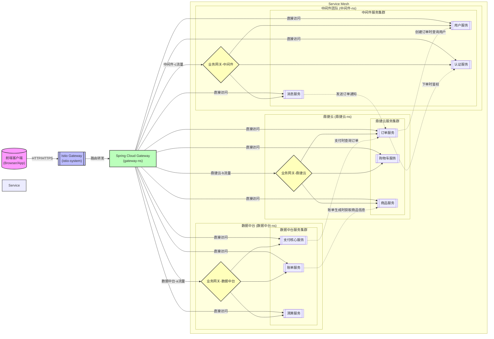

```mermaid

flowchart LR
    client[("前端客户端<br>(Browser/App)")]
    istio[["Istio Gateway<br>(istio-system)"]]
    scg["Spring Cloud Gateway<br>(gateway-ns)"]
    
    subgraph Service Mesh
        subgraph "数据中台 (数据中台-ns)"
            direction TB
            gw-a{"业务网关-数据中台"}
            subgraph "数据中台服务集群"
                svc-a1[["支付核心服务"]]
                svc-a2[["账单服务"]]
                svc-a3[["清算服务"]]
            end
        end
        
        subgraph "鼎捷云 (鼎捷云-ns)"
            direction TB
            gw-b{"业务网关-鼎捷云"}
            subgraph "鼎捷云服务集群"
                svc-b1[["订单服务"]]
                svc-b2[["购物车服务"]]
                svc-b3[["商品服务"]]
            end
        end
        
        subgraph "中间件团队 (中间件-ns)"
            direction TB
            gw-c{"业务网关-中间件"}
            subgraph "中间件服务集群"
                svc-c1[["用户服务"]]
                svc-c2[["认证服务"]]
                svc-c3[["消息服务"]]
            end
        end
    end
    
    %% 外部访问路由
    client -->|HTTP/HTTPS| istio
    istio -->|路由转发| scg
    
    %% 数据中台-a-的路由
    scg -->|数据中台-a流量| gw-a
    scg -->|直接访问| svc-a1 & svc-a2 & svc-a3
    gw-a --> svc-a1 & svc-a2 & svc-a3
    
    %% 鼎捷云-b-的路由
    scg -->|鼎捷云-b流量| gw-b
    scg -->|直接访问| svc-b1 & svc-b2 & svc-b3
    gw-b --> svc-b1 & svc-b2 & svc-b3
    
    %% 中间件-c-的路由
    scg -->|中间件-c流量| gw-c
    scg -->|直接访问| svc-c1 & svc-c2 & svc-c3
    gw-c --> svc-c1 & svc-c2 & svc-c3
    
    %% 跨团队服务调用（直接通过service name）
    svc-b1 -.->|创建订单时查询用户| svc-c1
    svc-b1 -.->|下单时鉴权| svc-c2
    svc-a1 -.->|支付时查询订单| svc-b1
    svc-a2 -.->|账单生成时获取商品信息| svc-b3
    svc-c3 -.->|发送订单通知| svc-b1
    
    style client fill:#f9f,stroke:#333,stroke-width:2px
    style istio fill:#bbf,stroke:#333,stroke-width:2px
    style scg fill:#bfb,stroke:#333,stroke-width:2px
    style gw-a fill:#ffb,stroke:#333,stroke-width:2px
    style gw-b fill:#ffb,stroke:#333,stroke-width:2px
    style gw-c fill:#ffb,stroke:#333,stroke-width:2px
    style Service Mesh fill:#f5f5f5,stroke:#666,stroke-width:2px

```