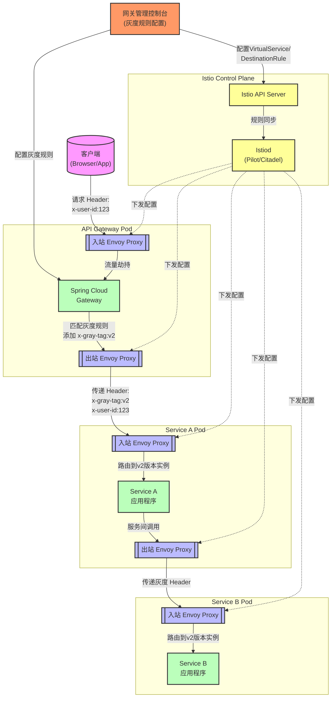

```mermaid

flowchart TD
   %% 管理端
   admin["网关管理控制台<br>(灰度规则配置)"]
   
   %% Istio控制平面
   subgraph "Istio Control Plane"
       istiod["Istiod<br>(Pilot/Citadel)"]
       istio_api["Istio API Server"]
   end
   
   %% 客户端
   client[("客户端<br>(Browser/App)")]
   
   %% 网关层
   subgraph "API Gateway Pod"
       gw["Spring Cloud<br>Gateway"]
       gw_envoy_in[["入站 Envoy Proxy"]]
       gw_envoy_out[["出站 Envoy Proxy"]]
   end
   
   %% Service A
   subgraph "Service A Pod"
       svc_a["Service A<br>应用程序"]
       svc_a_envoy_in[["入站 Envoy Proxy"]]
       svc_a_envoy_out[["出站 Envoy Proxy"]]
   end
   
   %% Service B
   subgraph "Service B Pod"
       svc_b["Service B<br>应用程序"]
       svc_b_envoy_in[["入站 Envoy Proxy"]]
   end

   %% 控制面配置流
   admin -->|"配置灰度规则"| gw
   admin -->|"配置VirtualService/<br>DestinationRule"| istio_api
   istio_api -->|"规则同步"| istiod
   istiod -.->|"下发配置"| gw_envoy_in
   istiod -.->|"下发配置"| gw_envoy_out
   istiod -.->|"下发配置"| svc_a_envoy_in
   istiod -.->|"下发配置"| svc_a_envoy_out
   istiod -.->|"下发配置"| svc_b_envoy_in

   %% 数据面流量路径
   client -->|"请求 Header:<br>x-user-id:123"| gw_envoy_in
   gw_envoy_in -->|"流量劫持"| gw
   
   gw -->|"匹配灰度规则<br>添加 x-gray-tag:v2"| gw_envoy_out
   
   gw_envoy_out -->|"传递 Header:<br>x-gray-tag:v2<br>x-user-id:123"| svc_a_envoy_in
   
   svc_a_envoy_in -->|"路由到v2版本实例"| svc_a
   
   svc_a -->|"服务间调用"| svc_a_envoy_out
   
   svc_a_envoy_out -->|"传递灰度 Header"| svc_b_envoy_in
   
   svc_b_envoy_in -->|"路由到v2版本实例"| svc_b

   %% 样式设置
   style client fill:#f9f,stroke:#333,stroke-width:2px
   style admin fill:#f96,stroke:#333,stroke-width:2px
   style gw fill:#bfb,stroke:#333,stroke-width:2px
   style svc_a fill:#bfb,stroke:#333,stroke-width:2px
   style svc_b fill:#bfb,stroke:#333,stroke-width:2px
   style istiod fill:#ff9,stroke:#333,stroke-width:2px
   style istio_api fill:#ff9,stroke:#333,stroke-width:2px
   
   %% Envoy代理样式
   style gw_envoy_in fill:#bbf,stroke:#333,stroke-width:2px
   style gw_envoy_out fill:#bbf,stroke:#333,stroke-width:2px
   style svc_a_envoy_in fill:#bbf,stroke:#333,stroke-width:2px
   style svc_a_envoy_out fill:#bbf,stroke:#333,stroke-width:2px
   style svc_b_envoy_in fill:#bbf,stroke:#333,stroke-width:2px

```