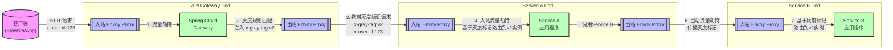

```mermaid

flowchart LR
    %% 客户端
    client[("客户端<br>(Browser/App)")]
    
    %% 网关层
    subgraph "API Gateway Pod"
        gw["Spring Cloud<br>Gateway"]
        gw_envoy_in[["入站 Envoy Proxy"]]
        gw_envoy_out[["出站 Envoy Proxy"]]
    end
    
    %% Service A
    subgraph "Service A Pod"
        svc_a["Service A<br>应用程序"]
        svc_a_envoy_in[["入站 Envoy Proxy"]]
        svc_a_envoy_out[["出站 Envoy Proxy"]]
    end
    
    %% Service B
    subgraph "Service B Pod"
        svc_b["Service B<br>应用程序"]
        svc_b_envoy_in[["入站 Envoy Proxy"]]
    end

    %% 流量路径
    client -->|"HTTP请求<br>x-user-id:123"| gw_envoy_in
    gw_envoy_in -->|"1. 流量劫持"| gw
    
    gw -->|"2. 灰度规则匹配<br>注入 x-gray-tag:v2"| gw_envoy_out
    
    gw_envoy_out -->|"3. 携带灰度标记请求<br>x-gray-tag:v2<br>x-user-id:123"| svc_a_envoy_in
    
    svc_a_envoy_in -->|"4. 入站流量劫持<br>基于灰度标记路由到v2实例"| svc_a
    
    svc_a -->|"5. 调用Service B"| svc_a_envoy_out
    
    svc_a_envoy_out -->|"6. 出站流量劫持<br>传播灰度标记"| svc_b_envoy_in
    
    svc_b_envoy_in -->|"7. 基于灰度标记<br>路由到v2实例"| svc_b

    %% 样式
    style client fill:#f9f,stroke:#333,stroke-width:2px
    style gw fill:#bfb,stroke:#333,stroke-width:2px
    style svc_a fill:#bfb,stroke:#333,stroke-width:2px
    style svc_b fill:#bfb,stroke:#333,stroke-width:2px
    
    %% Envoy代理样式
    style gw_envoy_in fill:#bbf,stroke:#333,stroke-width:2px
    style gw_envoy_out fill:#bbf,stroke:#333,stroke-width:2px
    style svc_a_envoy_in fill:#bbf,stroke:#333,stroke-width:2px
    style svc_a_envoy_out fill:#bbf,stroke:#333,stroke-width:2px
    style svc_b_envoy_in fill:#bbf,stroke:#333,stroke-width:2px

```