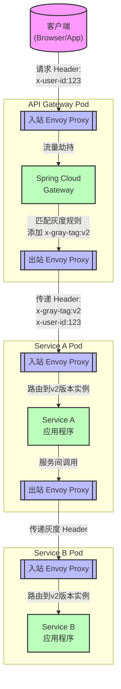

```mermaid

flowchart TD
    %% 客户端
    client[("客户端<br>(Browser/App)")]
    
    %% 网关层
    subgraph "API Gateway Pod"
        gw["Spring Cloud<br>Gateway"]
        gw_envoy_in[["入站 Envoy Proxy"]]
        gw_envoy_out[["出站 Envoy Proxy"]]
    end
    
    %% Service A
    subgraph "Service A Pod"
        svc_a["Service A<br>应用程序"]
        svc_a_envoy_in[["入站 Envoy Proxy"]]
        svc_a_envoy_out[["出站 Envoy Proxy"]]
    end
    
    %% Service B
    subgraph "Service B Pod"
        svc_b["Service B<br>应用程序"]
        svc_b_envoy_in[["入站 Envoy Proxy"]]
    end

    %% 流量路径 - 修复连线内容格式
    client --> |"请求 Header:<br>x-user-id:123"| gw_envoy_in
    gw_envoy_in --> |"流量劫持"| gw
    
    gw --> |"匹配灰度规则<br>添加 x-gray-tag:v2"| gw_envoy_out
    
    gw_envoy_out --> |"传递 Header:<br>x-gray-tag:v2<br>x-user-id:123"| svc_a_envoy_in
    
    svc_a_envoy_in --> |"路由到v2版本实例"| svc_a
    
    svc_a --> |"服务间调用"| svc_a_envoy_out
    
    svc_a_envoy_out --> |"传递灰度 Header"| svc_b_envoy_in
    
    svc_b_envoy_in --> |"路由到v2版本实例"| svc_b

    %% 样式设置
    style client fill:#f9f,stroke:#333,stroke-width:2px
    style gw fill:#bfb,stroke:#333,stroke-width:2px
    style svc_a fill:#bfb,stroke:#333,stroke-width:2px
    style svc_b fill:#bfb,stroke:#333,stroke-width:2px
    
    %% Envoy代理样式
    style gw_envoy_in fill:#bbf,stroke:#333,stroke-width:2px
    style gw_envoy_out fill:#bbf,stroke:#333,stroke-width:2px
    style svc_a_envoy_in fill:#bbf,stroke:#333,stroke-width:2px
    style svc_a_envoy_out fill:#bbf,stroke:#333,stroke-width:2px
    style svc_b_envoy_in fill:#bbf,stroke:#333,stroke-width:2px

```